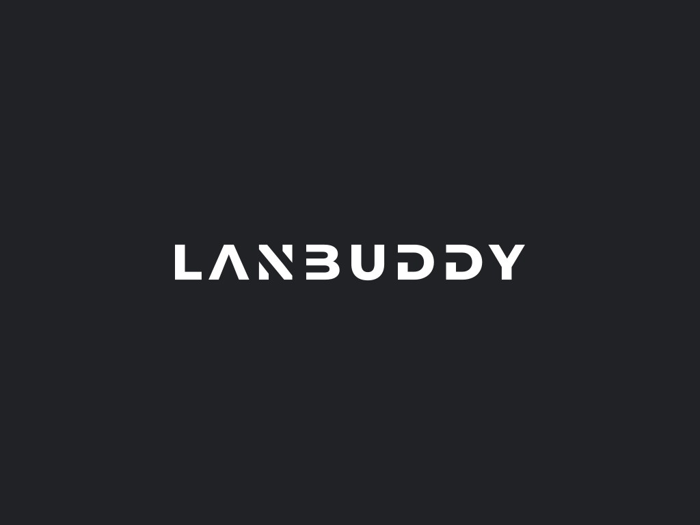
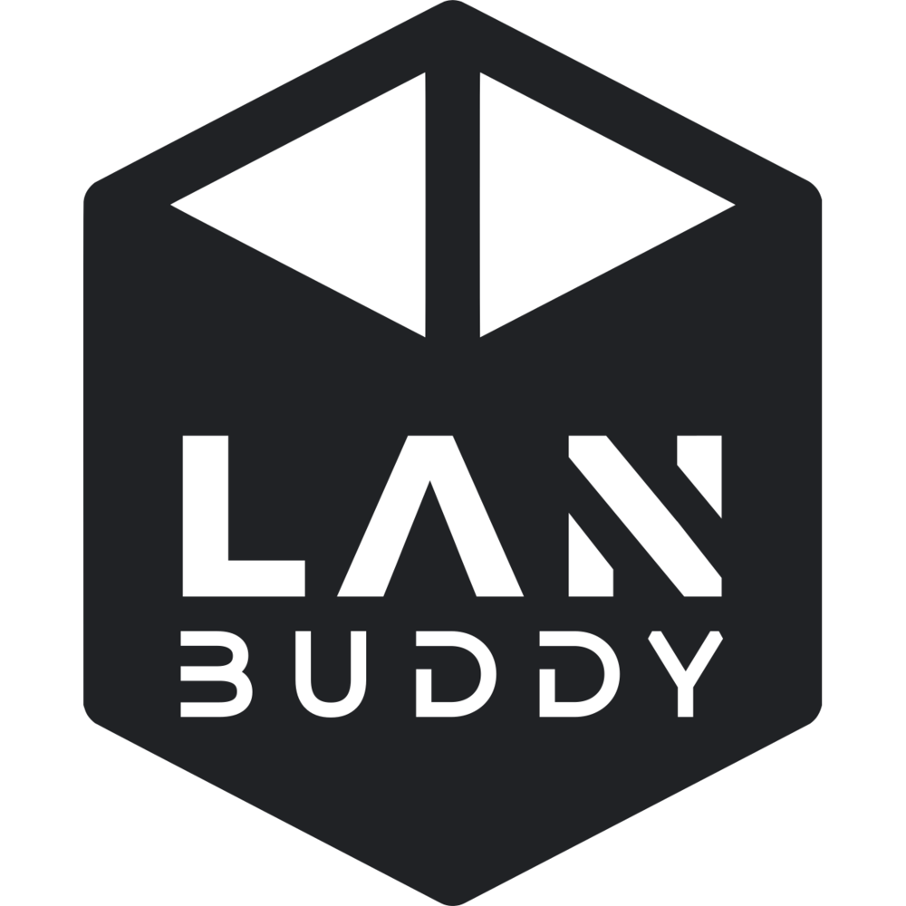

# Lanbuddy Assets
Contains logos and images used by the lanbuddy project.

## Logos
Logos are contained in the `/logos` folder. They are available as .svg or .png files.
Currently we have 3 different logos for the various products developed by the lanbuddy team:
### Brand Logos
`/logos/lanbuddy/*`  
The main brand logo consists of the uppercase word 'LANBUDDY' written in horizontal or vertical format. The brand logo is never inside of a logo container. Only sub-applications such as the client or server have containerized logos.

The horizontal logo looks like this:

### Client Logos
`/logos/lanbuddy-client/*`
The client logo consists of the vertical version of the lanbuddy brand logo contained in a 'overlapping double-circle'. This logo is only used in context with the [lanbuddy client application](https://github.com/lanbuddy/lanbuddy-client). Mainly as icon for the executable, tray icon, etc.

### Server Logos
`/logos/lanbuddy-server/*`  
The server logo consists of the vertical version of the lanbuddy brand logo contained in a 3d-cube-like object. This logo is only used in context with the [lanbuddy server stack](https://github.com/lanbuddy/lanbuddy-server).

